# ARsneakers

ARsneaker adalah platform e-commerce inovatif yang menggabungkan teknologi **Augmented Reality (AR)** untuk memberikan pengalaman belanja sepatu yang lebih interaktif dan realistis. Dengan ARsneaker, pengguna dapat melihat dan mencoba sepatu secara virtual dalam waktu nyata sebelum melakukan pembelian.

## 🚀 Fitur Utama

- **Augmented Reality (AR)**: Lihat sneakers dalam 3D dan visualisasikan langsung di dunia nyata.
- **Katalog Sneakers**: Jelajahi berbagai koleksi sepatu terbaru dan terbaik.
- **User-Friendly UI/UX**: Desain yang modern dan responsif untuk pengalaman belanja yang nyaman.
- **Sistem Keranjang & Checkout**: Tambahkan produk ke keranjang dan lakukan pembayaran dengan mudah.
- **Integrasi Pembayaran**: Mendukung berbagai metode pembayaran online yang aman.
- **Ulasan & Rating**: Berikan dan baca ulasan pengguna lain tentang produk.
- **Multi-Platform Support**: Tersedia untuk Android dan iOS menggunakan Flutter.

## 🛠️ Teknologi yang Digunakan

- **Frontend**: Flutter, Google Fonts, Lottie, Carousel Slider
- **Backend**: Firebase Firestore, Firebase Authentication, Firebase Storage
- **AR Engine**: ARCore Flutter Plugin, Vector Math
- **State Management**: GetX
- **Networking**: Dio
- **Local Storage**: Shared Preferences, Path Provider
- **Graph & Chart**: FL Chart

## 📱 Perangkat Development

- **Java Version**: 17
- **Minimum SDK**: 24
- **OS**: Android 7.0 (Nougat) ke atas
- **RAM**: Minimum 3GB untuk pengalaman yang optimal
- **Processor**: Quad-core 1.8 GHz atau lebih tinggi

# 📌 Alur Penggunaan Aplikasi

## 🔄 Urutan Penggunaan Aplikasi

1. **User menjalankan aplikasi**

   - Muncul splash screen dengan logo aplikasi.
   - 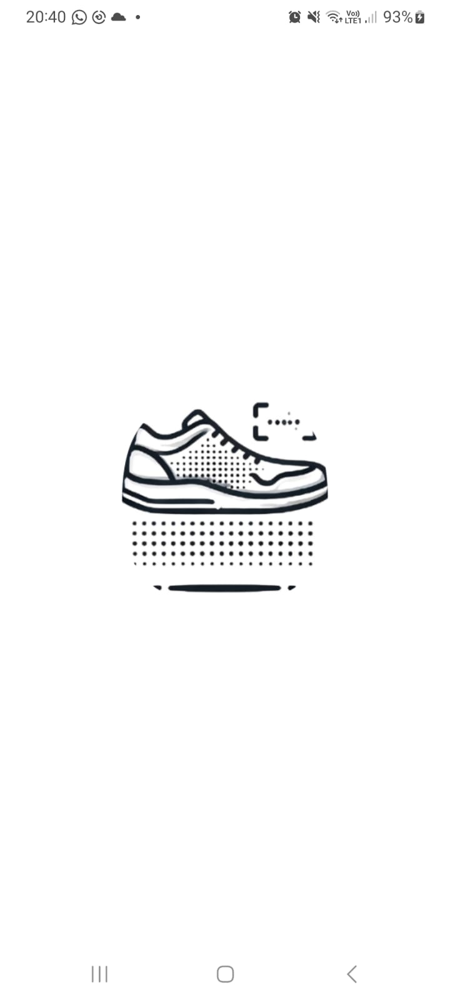

2. **User memilih untuk daftar atau masuk**

   - Jika memilih **Daftar**, user harus mengisi **email, username, dan password**, lalu datanya disimpan ke Firestore.
   - Jika memilih **Masuk**, user menginputkan **email dan password** yang telah didaftarkan.
   - Kalian bisa menggunakan akun gratis yang digunakan untuk mengakses aplikasi :
     **email : user@gmail.com**
     **password : 1234abc**
   - 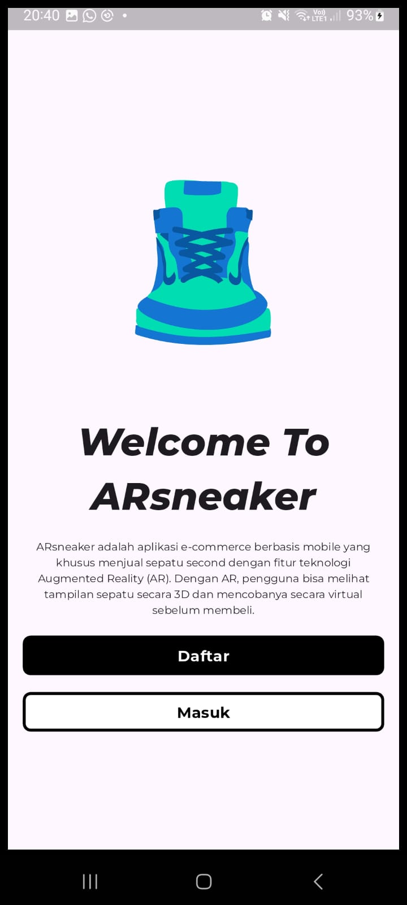
   - 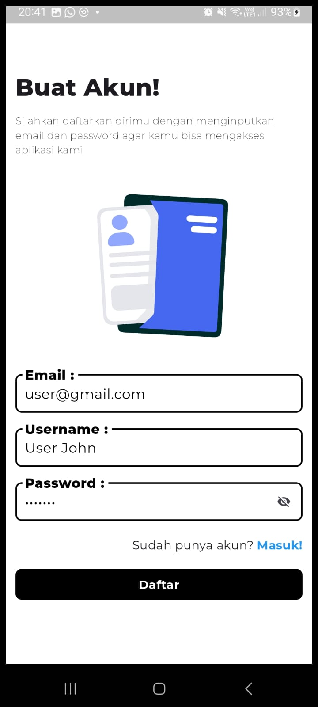
   - 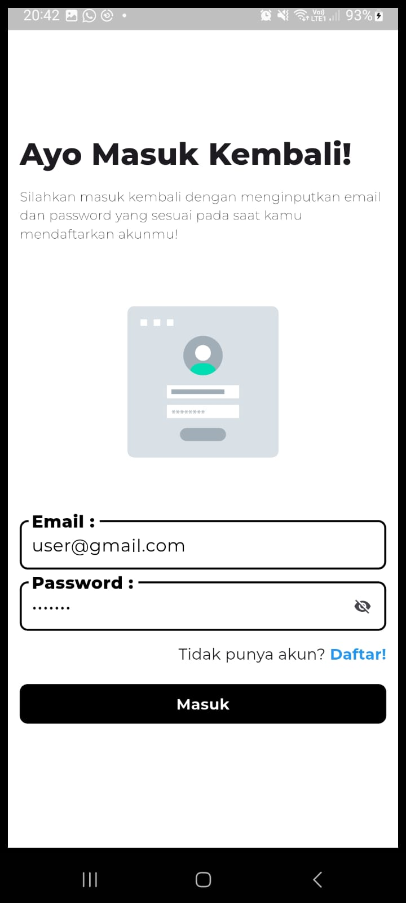

3. **Autentikasi**

   - Firebase Authentication akan memproses login tanpa menyimpan password pengguna.
   - Jika berhasil, informasi user disimpan di **local storage** menggunakan Shared Preferences.
   - 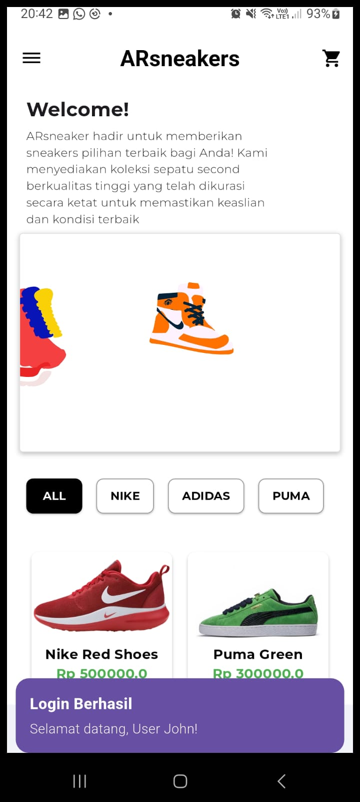

4. **Home Page**

   - Menampilkan **gallery card sneakers**, dapat difilter berdasarkan kategori.
   - Card produk dapat diklik untuk melihat **detail produk**.
   - 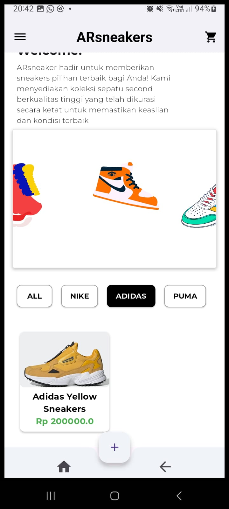

5. **Navigasi Aplikasi**

   - AppBar dan Drawer menyediakan akses ke berbagai halaman dalam aplikasi.
   - 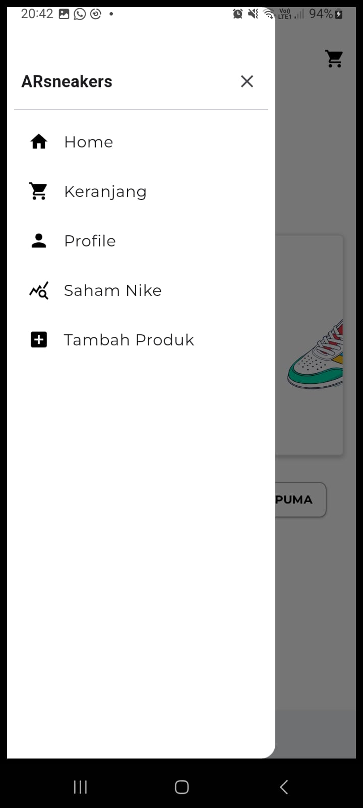

6. **Detail Produk**

   - Menampilkan **gambar, deskripsi, harga, stok**.
   - Tombol untuk menambahkan produk ke dalam keranjang.
   - Tombol untuk masuk ke dunia **AR** menggunakan **ARCore Flutter Plugin**.
   - 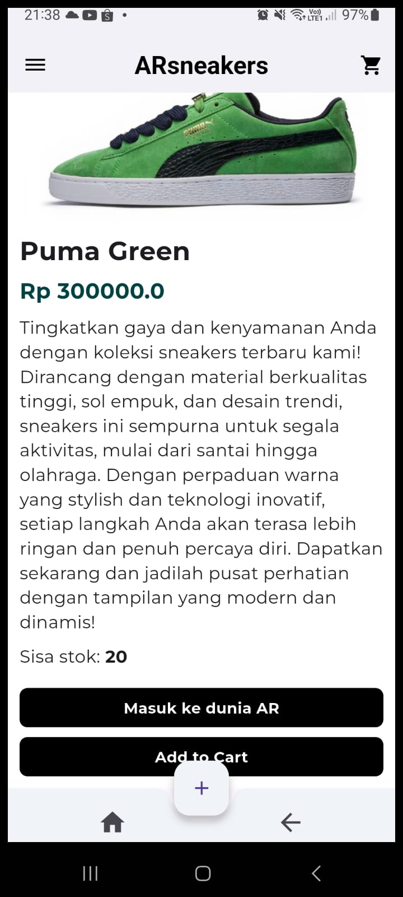

7. **AR Session**

   - User diminta mencari **platform yang flat**.
   - Setelah muncul **dots dots**, user bisa **tap untuk memunculkan objek** sepatu.
   - 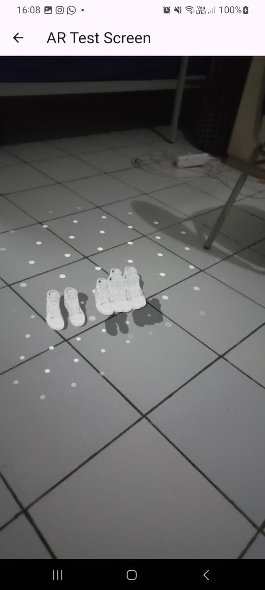

8. **Profile Page**

   - Menampilkan informasi user dan beberapa menu seperti:
     - **Tambah Produk**
     - **Keranjang**
     - **Logout**
     - **Saham Nike**
   - 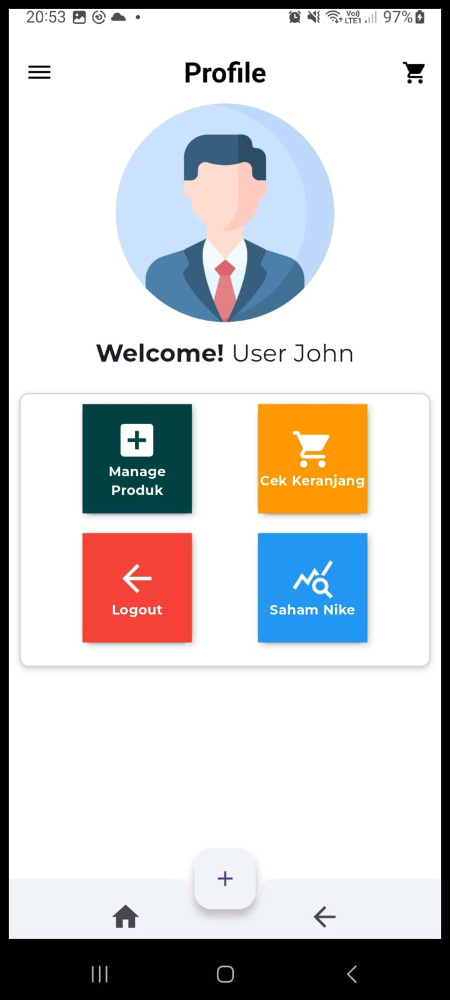

9. **Product Manager Page**

   - Menampilkan **list produk**.
   - User bisa **menambah produk** dengan menginputkan **nama, deskripsi, stok, harga, dan image URL**.
   - User bisa **mengedit produk**, ketika mengklik ikon **edit**, informasi produk akan muncul dan bisa diperbarui.
   - 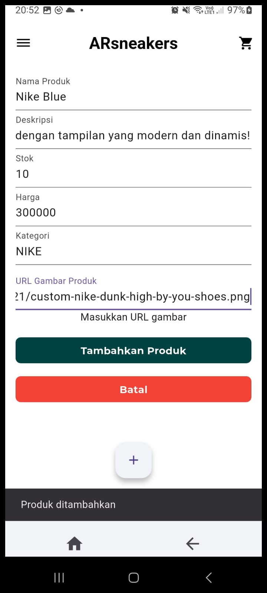
   - 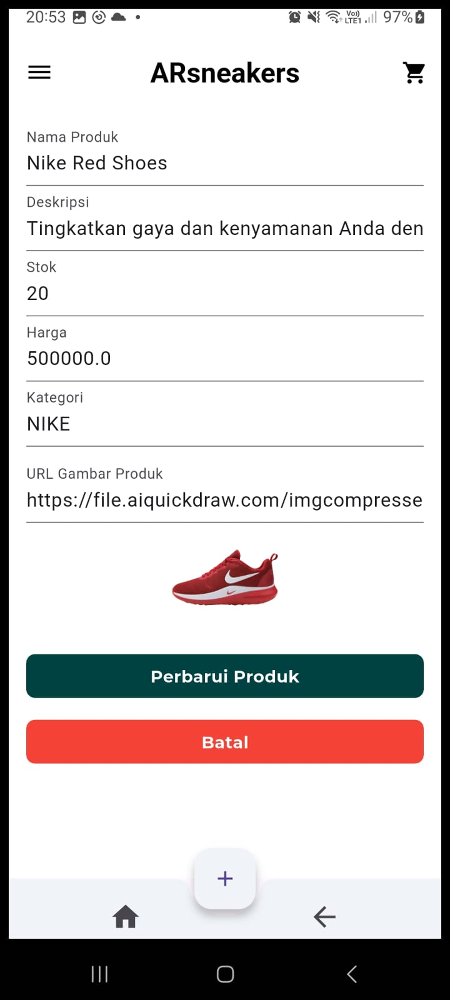

10. **Saham Nike Page**

    - Menampilkan **grafik saham Nike**.
    - Data diambil dari API: [Financial Modeling Prep](https://financialmodelingprep.com/api/v3/historical-price-full/NKE?apikey=YOUR_API_KEY).
    - 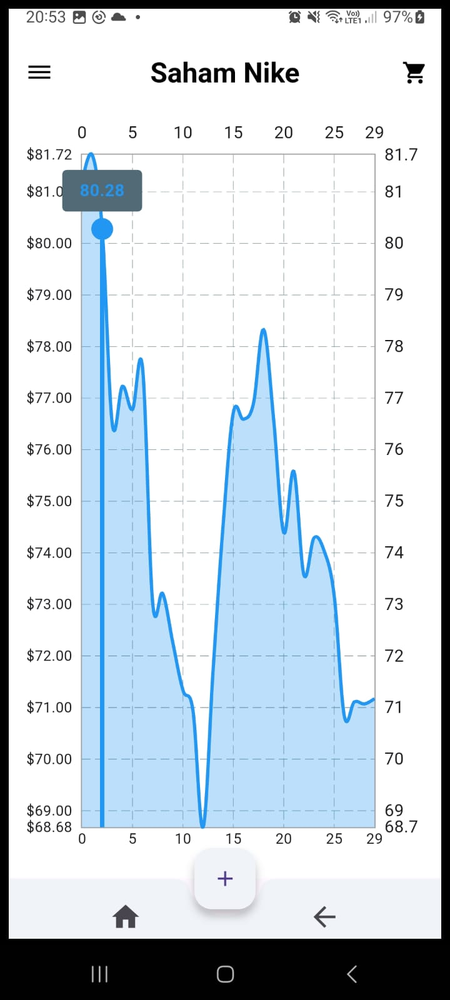

11. **Keranjang & Checkout**

    - Produk dalam keranjang bisa diatur **quantity-nya** dan melihat total harga.
    - Saat menekan tombol **Order**, user diarahkan ke **Invoice Page**.
    - 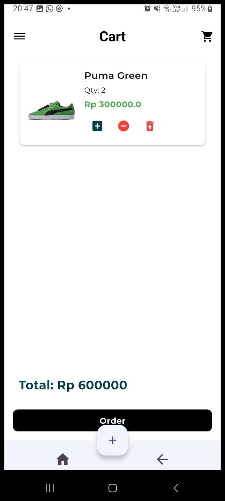
    - 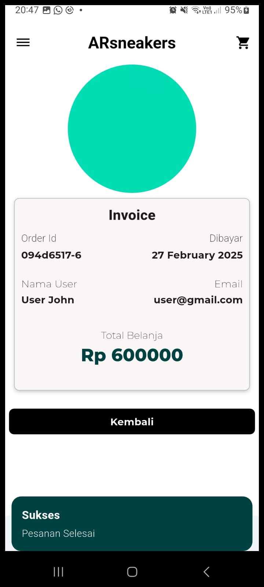

12. **Logout**
    - Saat user logout, informasi login yang tersimpan di **local storage** akan dihapus.
    - 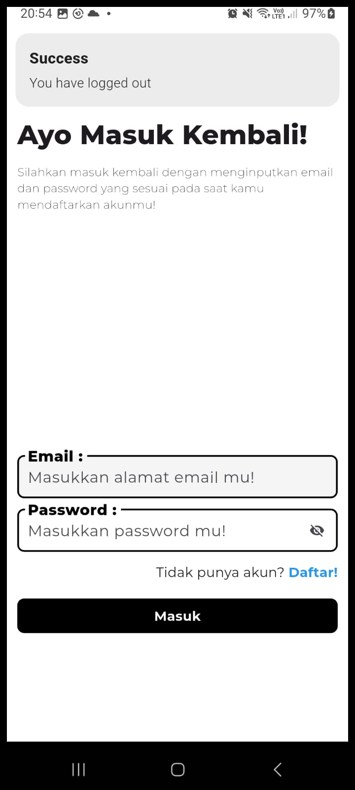

## 📦 Instalasi & Menjalankan Proyek

1. Clone repositori ini:
   git remote add origin https://github.com/Mobile-Innovation-Laboratory/Flutter_IBAdiRadityaP_ARsneakers.git
2. Install dependensi:
   flutter pub get
3. Jalankan aplikasi:
   flutter run

---

**ARsneaker - Cara Baru Berbelanja Sneakers dengan Teknologi AR!**
